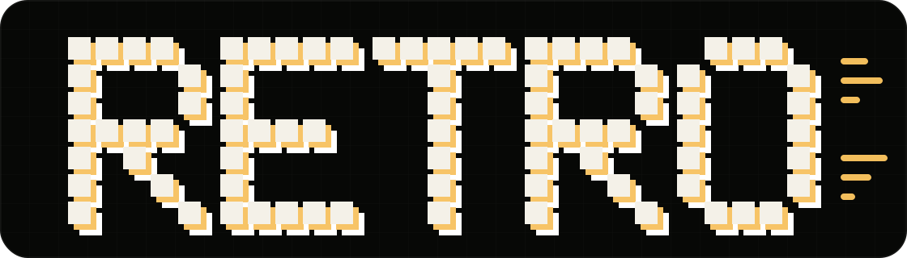
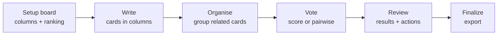
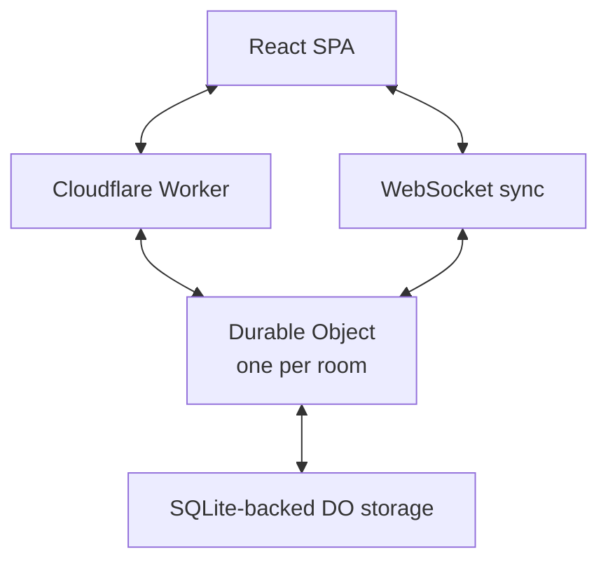

<p align="center">
  
</p>

<h1 align="center">THX Retro Board</h1>

<p align="center">
  Run focused team retros, rank the signal, and export clean outcomes.
</p>

<p align="center">
  <a href="https://retro.thethracian.com"><strong>Open the app</strong></a>
  ·
  <a href="#quick-start"><strong>Run locally</strong></a>
  ·
  <a href="#how-it-works"><strong>How it works</strong></a>
  ·
  <a href="#privacy-and-abuse-controls"><strong>Privacy model</strong></a>
</p>

<p align="center">
  
  
  
  
  
</p>

THX Retro Board is a real-time retrospective app for teams that need more than a wall of sticky notes. It gives facilitators a structured flow, gives participants a fast collaborative board, and turns the final discussion into anonymous exports you can analyze later.

It runs on Cloudflare Workers and Durable Objects, so every room has one server-authoritative state owner, live WebSocket sync, and no separate app server to operate.

## Why Teams Use It

- **Board setup before the meeting drifts**: lock columns, voting method, and score budget before writing starts.
- **Kanban-style writing**: add cards directly inside Mad, Glad, Sad, or whatever columns your retro needs.
- **Column-aware grouping**: organize duplicates without losing the original context of where the feedback came from.
- **Two ranking modes**: move fast with score voting, or get a stronger ordering with pairwise comparisons.
- **Live facilitator review**: one person drives the review slide, and every participant sees the same result in real time.
- **Collaborative actions**: everyone can add, edit, and remove action items during review.
- **Clean exports**: save the full retro as anonymous JSON or Markdown, and export actions separately as JSON, Markdown, or CSV.

## Quick Start

```bash
git clone git@github.com:stefan-vatov/thx-retro-board.git
cd thx-retro-board
npm install
npm run dev -- --host 127.0.0.1 --port 8787
```

Open [http://127.0.0.1:8787](http://127.0.0.1:8787), create a room, then open the invite link in another browser profile to test collaboration.

## How It Works



### 1. Setup

The facilitator configures the board before participants start writing. Columns, ranking mode, and score budget are locked once the room advances.

Default columns are:

| Mad | Glad | Sad |
| --- | --- | --- |
| Risks, blockers, frustrations | Wins, improvements, bright spots | Losses, disappointments, unresolved concerns |

### 2. Write

Participants add cards directly in the right column. Cards behave like a lightweight kanban board, with ownership rules so people can edit or delete their own write-phase cards without touching someone else's.

### 3. Organise

Teams group related cards inside their original columns. A group becomes one decision target for ranking, while still showing every card inside it during vote and review.

### 4. Vote

Pick the ranking mode that fits the room.

| Mode | Use When | Result |
| --- | --- | --- |
| Score voting | You need a quick prioritization pass | Participants spend a fixed vote budget across targets. |
| Pairwise ranking | You want a clearer order for small groups | Participants compare every target against every other target. |

Decision targets are global across the board. A group counts as one target, and every ungrouped card also counts as one target.

### 5. Review

The facilitator controls the review slide for everyone. Results show column context, grouped cards, ungrouped cards, scores, pairwise wins, and emoji reactions.

Actions are fully collaborative during review: add, edit, remove, then export.

### 6. Finalize

Export the retro without leaking participant identity.

| Export | Formats | Includes |
| --- | --- | --- |
| Full retro | JSON, Markdown | Columns, cards, groups, votes, ranking results, actions, reactions |
| Actions only | JSON, Markdown, CSV | Action items ready for docs, tickets, or spreadsheets |

## Product Details

### Real-Time Rooms

- Shareable invite links.
- Participant presence.
- Live phase, board, vote, review, action, and reaction updates.
- Reconnect tokens stored only in the browser.
- WebSocket credentials are not embedded in invite links.

### Reactions

Emoji reactions work on cards and groups across the session. They are visible in writing, organizing, voting, and review so lightweight sentiment does not disappear when the retro moves forward.

### Facilitator Controls

- Advance the room through setup, write, organize, vote, review, and finalize.
- Configure columns only during setup.
- Choose score voting or pairwise ranking.
- Start timers and track elapsed room time.
- Drive the review slide for everyone.
- Delete room data immediately when needed.

## Architecture

THX Retro Board is one Cloudflare application:



- **React SPA**: room UI, optimistic interaction states, export surfaces.
- **Cloudflare Worker**: HTTP API routes, asset serving, SPA fallback.
- **Durable Object per room**: canonical room state, permissions, phase transitions, timers, votes, actions, and reactions.
- **SQLite-backed Durable Object storage**: persisted room snapshots while the room is active.
- **WebSockets with hibernation support**: low-overhead real-time sync.
- **Shared TypeScript domain model**: client, Worker, and tests use the same state contracts.

## Privacy And Abuse Controls

The app is designed for short-lived, low-friction retros rather than account-based record keeping.

- No account system.
- No participant names in exports.
- Room data auto-deletes about one hour after the last participant leaves.
- Facilitators can manually delete room data.
- Production room creation fails closed unless Cloudflare Turnstile and both rate limiters are configured.
- Room creation is rate-limited in the Worker per client IP.
- Room access is rate-limited and malformed room IDs are rejected before a Durable Object is touched.
- JSON API bodies and WebSocket messages are size-limited before mutation handling.
- Per-room caps limit participants, cards, groups, actions, reactions, pairwise comparisons, vote budgets, and columns.

## Scripts

| Command | Description |
| --- | --- |
| `npm run dev` | Start the local Cloudflare/Vite development server. |
| `npm run build` | Type-check and build for production. |
| `npm run typecheck` | Run TypeScript project checks. |
| `npm run lint` | Run ESLint over `src/` and `worker/`. |
| `npm run test` | Run Vitest unit and Worker integration tests. |
| `npm run test:e2e` | Run Playwright end-to-end tests. |
| `npm run preview` | Build and preview production output locally. |
| `npm run deploy` | Build and deploy with Wrangler. |

## Deploying

The project is configured for Cloudflare Workers in [wrangler.jsonc](./wrangler.jsonc).

Production currently targets:

- Worker name: `thx-retro-board`
- Route: `retro.thethracian.com`
- Durable Object binding: `RETRO_ROOM`
- Room creation rate-limit binding: `ROOM_CREATE_RATE_LIMITER`
- Room access rate-limit binding: `ROOM_ACCESS_RATE_LIMITER`
- Public Turnstile site key: configured in `wrangler.jsonc`
- Required secret: `TURNSTILE_SECRET_KEY`

Set the Turnstile secret before production deploys:

```bash
wrangler secret put TURNSTILE_SECRET_KEY
```

For a fork, change the Worker name, route, and Cloudflare bindings before deploying.

## Project Structure

```text
src/
  components/      React UI for home, room, voting, review, finalize, reactions
  domain/          shared state model, validation, ranking, export formatting
  hooks/           room WebSocket connection and state reconciliation
  styles/          app design system and responsive UI
  api.ts           HTTP API client
worker/
  index.ts         Worker router, Turnstile checks, rate limiting, SPA fallback
  retro-room.ts    Durable Object room state machine
e2e/
  retro-flow.spec.ts
docs/
  assets/          README and project visuals
```

## Quality Checks

```bash
npm run typecheck
npm run lint
npm run test
npm run test:e2e
```

Tests cover room creation, joins, setup locks, column invariants, card ownership, grouping, voting, pairwise ranking, review navigation, anonymous exports, reactions, WebSocket auth, reconnect behavior, and end-to-end collaboration flow.

## Contributing

Issues and pull requests are welcome. Keep changes focused, add tests for state-machine behavior, and run the quality checks before opening a PR.

## License

MIT License. See [LICENSE](./LICENSE) for the full text.
