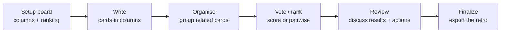

# THX Retro Board

> Run focused team retros, rank the signal, and export clean outcomes.

<p>
  
  
  
  
  
</p>

THX Retro Board is a real-time retrospective app for small teams that need more than a pile of sticky notes. It gives the facilitator a structured flow, gives participants a fast collaborative board, and turns the final discussion into exports you can analyze later.

It runs as a Cloudflare Worker with Durable Objects, so each room has a server-authoritative state owner, real-time WebSocket sync, and no separate app server to operate.

## Why It Exists

Most retro tools stop at collection. Teams still have to fight through duplicates, vague priorities, and action items that disappear after the call.

THX Retro Board keeps the session moving:

- **Setup locks the rules before writing starts**: columns, vote budget, and ranking method are decided up front.
- **Write happens directly in columns**: participants add cards where they belong instead of using a detached backlog.
- **Organise preserves context**: groups stay inside their original column, so "Mad", "Glad", and "Sad" do not collapse into noise.
- **Ranking supports small teams**: use classic score voting or pairwise comparisons across groups and ungrouped cards.
- **Review becomes a presentation flow**: facilitator-controlled results move live for everyone in the room.
- **Actions are collaborative**: anyone can add, edit, or remove action items during review.
- **Exports are built in**: save the retro as anonymous JSON or Markdown, and export actions separately as Markdown, JSON, or CSV.

## The Flow



## Features

### Facilitated Retros

- Default board columns: **Mad**, **Glad**, **Sad**.
- Facilitator can rename, reorder, add, or remove columns during setup.
- Non-facilitators wait on setup until the board is ready.
- Phase controls, timer controls, vote budget, and review navigation are facilitator-owned.
- The elapsed retro clock and phase tracker keep the room oriented.

### Collaborative Board

- Multi-user rooms through a shareable invite link.
- Real-time participant presence and state updates.
- Cards are created inside columns, kanban-style.
- Participants can edit or delete their own write-phase cards.
- Organise mode supports column-scoped groups, reordering, and drag/drop refinement.
- Discord-style emoji reactions work on cards and groups across write, organise, vote, and review.

### Ranking That Fits Small Teams

Two ranking modes are available during setup:

| Method | Best For | How It Works |
| --- | --- | --- |
| Score voting | Fast prioritization | Each participant spends a fixed vote budget across decision targets. |
| Pairwise ranking | Higher-confidence ordering | Participants choose between every pair of decision targets, then results are ordered by wins. |

Decision targets are global: every group and every ungrouped card is compared against the rest of the board. A group counts as one target, while still showing the cards inside it.

### Review And Export

- Review is a live, facilitator-driven slideshow.
- Results include grouped and ungrouped items in their original column context.
- Reactions remain visible on review cards and groups.
- Actions are collaboratively editable during review.
- Finalize exports:
  - full retro as JSON
  - full retro as Markdown
  - actions as JSON
  - actions as Markdown
  - actions as CSV for spreadsheets

Exports are anonymous: participant IDs and authors are stripped from saved retro data.

## Quick Start

```sh
npm install
npm run dev -- --host 127.0.0.1 --port 8787
```

Open [http://127.0.0.1:8787](http://127.0.0.1:8787), create a room, and invite a second browser profile or window to test collaboration.

## Scripts

| Command | Description |
| --- | --- |
| `npm run dev` | Start the local Cloudflare/Vite development server. |
| `npm run build` | Type-check and build for production. |
| `npm run typecheck` | Run TypeScript project checks. |
| `npm run lint` | Run ESLint over `src/` and `worker/`. |
| `npm run test` | Run Vitest unit and Worker integration tests. |
| `npm run test:e2e` | Run Playwright end-to-end tests. |
| `npm run preview` | Build and preview production output locally. |
| `npm run deploy` | Build and deploy with Wrangler. |

## Architecture

THX Retro Board is built as a single Cloudflare application:

- **React SPA** for the room UI, routing, and optimistic interaction states.
- **Cloudflare Worker** for HTTP API routes and static asset serving.
- **Durable Object per room** as the canonical state machine.
- **SQLite-backed Durable Object storage** for persisted room snapshots.
- **WebSockets with hibernation support** for low-overhead real-time sync.
- **Shared TypeScript domain model** used by client, Worker, and tests.

The Durable Object owns room state, permissions, phase transitions, timers, columns, items, groups, votes, pairwise choices, review position, actions, and reactions. Clients send intent; the server validates and broadcasts authoritative updates.

## State Model

The room state is versioned and server-authoritative:

- `setup`: facilitator configures columns and ranking.
- `write`: participants add cards in columns.
- `organise`: cards are grouped and reordered within their original column.
- `vote`: teams rank groups and ungrouped cards.
- `review`: facilitator presents results while the room captures actions.
- `finalize`: exports are generated for long-term analysis.

Rooms use a schema-versioned state shape, with reconnect tokens stored only in the browser. Invite links do not include participant credentials.

## Testing

```sh
npm run typecheck
npm run lint
npm run test
npm run test:e2e
```

Coverage includes room creation, joins, phase permissions, setup locks, column invariants, card ownership, group operations, voting, pairwise ranking, review navigation, anonymous exports, reactions, WebSocket authentication, reconnect behavior, and end-to-end multi-user flow.

## Deploying To Cloudflare

The project is configured for Cloudflare Workers in [wrangler.jsonc](./wrangler.jsonc).

```sh
npm run deploy
```

Deployment uses:

- Worker static assets
- Durable Object binding: `RETRO_ROOM`
- Durable Object migration for `RetroRoom`
- Custom route: `retro.thethracian.com`

For a fork or a different Cloudflare account, change the Worker name and route in `wrangler.jsonc` before deploying.

## Project Structure

```text
src/
  components/      React UI for home, room, vote, review, finalize, reactions
  domain/          shared state model, validation, ranking, export formatting
  hooks/           room WebSocket connection and state reconciliation
  styles/          app design system and responsive UI
  api.ts           HTTP API client
worker/
  index.ts         Worker router and SPA fallback
  retro-room.ts    Durable Object room state machine
e2e/
  retro-flow.spec.ts
tests/
  test environment types/config
```

## Privacy Notes

- No account system is required.
- Room invite links are room-only links.
- Reconnect credentials are stored locally in the participant browser.
- WebSocket credentials are passed through protocols rather than exposed in invite links.
- Exported retros are anonymous and omit participant identities.

## License

No open-source license has been selected yet. Until a license is added, the code is source-visible but not automatically licensed for reuse.
